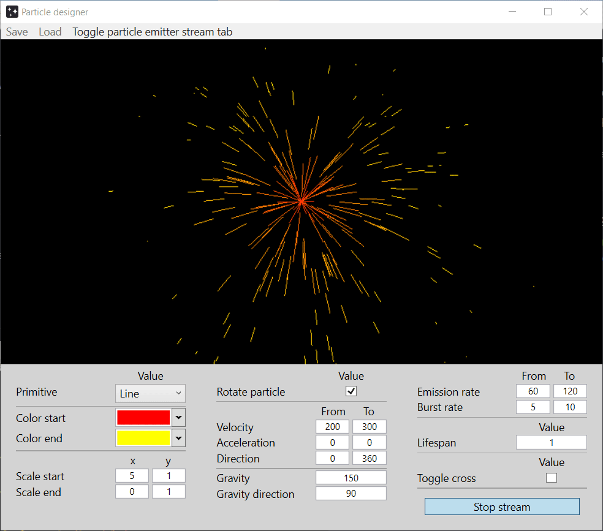
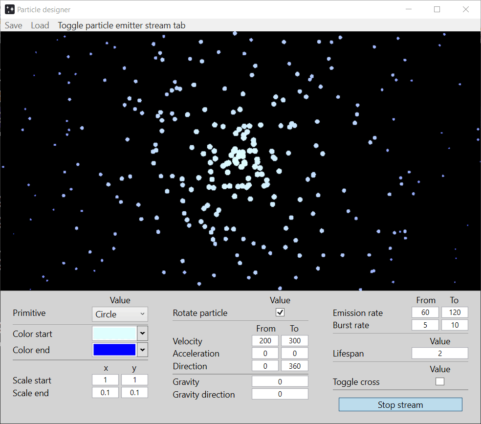

# Particle-designer

## App description
Particle designer is a program that let the user can create an effect using particles. At the center of the screen, the emitter splits particles based on the properties the user defines such as the velocity, the gravity, the changing color, the lifespan, etc. These particles can be save for further reloading for later uses.

## Demo
Firework effect

Snow flare effect

